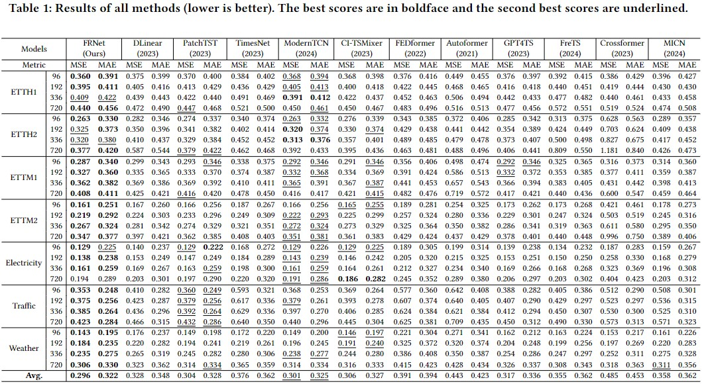

# Rebuttal to Reviewer KbcV

## Cons3:
While FRNet indeed draws upon established techniques such as FFT, mixer blocks, and patching, it innovatively introduces the "Frequency Rotation Module" – a novel component that uniquely integrates these methodologies into a unified lightweight framework, which is unprecedented in existing approaches. But simple stacking cannot achieve excellent performance

And our methodology diverges from standard practice in several technical aspects. 
1. FFT: Standard methods apply FFT once for static spectral info. We use FFT twice: first to find significant periods, then on each period individually, reveal their dynamic frequency evolution beyond static analysis. 
2. Mixer: We adapt mixers to complex values for frequency component interaction and prediction. Thus, our work transcends mere application of the individual techniques and contributes a distinct methodological advancement in the realm of time series analysis. 
3. Period-dependent patch strides size, rather than arbitrary size. 

## Cons4:
We've compared FRNet with PatchTST in Table 1. Since Contiformer specializes in irregular time series prediction (not our focus), we exclude it from our comparisons. To further evaluate FRNet, we now include experiments comparing it with MICN and Crossformer, in addition to the existing results: 

## Cons5 & Cons6:
To validate that FRNet's superiority stems from its PFR module, we compare FRNet with three variants. 
### V1: Predicting periodic components in the time domain without using FFT
### V2: Static frequency-domain prediction, like a frequency-domain Linear 
### V3: Ignoring both period dynamics and frequency-domain prediction. Results are below:

|  | length | FRNet | V1 | V2 | V3 |
| --- | --- | --- | --- | --- | --- |
| ETTH2 | 96 | **0.263** | 0.269 | 0.289 | 0.282 |
|| 192 | **0.325** | 0.331 | 0.344 | 0.350 | 
|| 336 | **0.320** | 0.332 | 0.343 | 0.410 | 
|| 720 | **0.377** | 0.378 | 0.414 | 0.587 | 
| ETTM1 | 96 | **0.287** | 0.310 | 0.327 | 0.299 |
|| 192 | **0.327** | 0.337 | 0.352 | 0.335 | 
|| 336 | **0.362** | 0.368 | 0.395 | 0.369 | 
|| 720 | **0.408** | 0.422 | 0.482 | 0.425 | 

It can be seen that removing the dynamic representation of the period in the frequency domain or not reshaping the time series for dynamic prediction will significantly reduce prediction performance.

