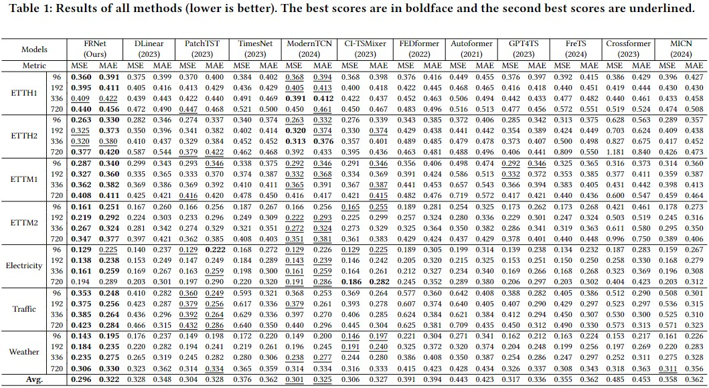

# FRNet: Frequency-based Rotation Network for Long-term Time Series Forecasting

This repo is the official Pytorch implementation of ["FRNet: Frequency-based Rotation Network for Long-term Time Series Forecasting"].

### Running the code

`sh scripts/FRNet/etth1.sh `

`sh scripts/FRNet/etth2.sh `

`sh scripts/FRNet/ettm1.sh `

`sh scripts/FRNet/ettm2.sh `

`sh scripts/FRNet/electricity.sh `

`sh scripts/FRNet/traffic.sh `

`sh scripts/FRNet/weather.sh `

### Datasets

Datasets are accessible within the Time Series Library at https://github.com/thuml/Time-Series-Library.

### Main Results

## Acknowledgement

We appreciate the following github repos a lot for their valuable code base or datasets:

1. Informer: https://github.com/zhouhaoyi/Informer2020
2. Autoformer: https://github.com/thuml/Autoformer
3. FEDformer: https://github.com/MAZiqing/FEDformer
4. LTSF-Linear: https://github.com/cure-lab/LTSF-Linear
5. PatchTST: https://github.com/PatchTST
6. TimesNet: https://github.com/thuml/Time-Series-Library